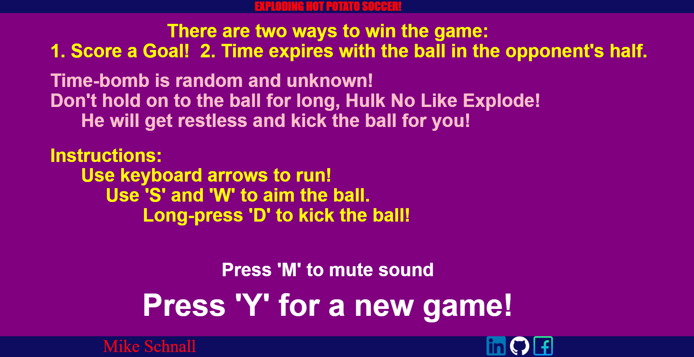

<p align="center">
  
</p>
<br></br>

<p align="center">
  
</p>
<br></br>


# [EXPLODING HOT POTATO SOCCER!](https://mordes89.github.io/EXPLODING-HOT-POTATO-SOCCER-/) - Mike Schnall.

Exploding Hot Potato Soccer! is a soccer game played in a rectangular grid with two goals, 
two avatars, a countdown timer, and a hot-potato/ball that explodes.

The objective of the game is to either score a goal by aiming the ball 
into the oponents net, or having the time expire and the ball explode 
on the oponent's side of the field. 

Live site [link](https://mordes89.github.io/EXPLODING-HOT-POTATO-SOCCER-/)

## In Exploding Hot Potato Soccer!, users are able to:
1. Kick a ball/hot-potato to the other side trying to score a goal.
2. Bounce the ball off the walls on its way to the oponent's goal.
3. Choose the direction and speed at which to shoot the ball. The ball 
   will stick to the player if the player catches it. Otherwise the ball 
   bounces off all sides of the court.


In addition, this project includes:
- Instructions for the user on their options at each point in the game.
- Fun sounds


### There are two ways to win the game:
1. Score a goal!
2. Time expires with the ball in the opponent's half.


# General
The AI player is an avater that moves around it's own
half chasing the ball.

The player is able to move vertically and horizontally using the arrow 
buttons. When in proximity to the ball, player takes posession, can run with the ball, aim the kick, and kick at a desired velocity. The user cannot hold on to the ball for long, as the avatar will kick the hot-potato away after a while.
There is a random timer that is not known to the user. At time expiration, the ball explodes. The side that the the ball exploded on loses the game.

### User choices include:
 - New game
 - Hyperlinks to my GitHub, Linkedin, Portfolio, and Facebook accounts

# Gameplay
Game controls are the keyboard arrows to move the avatar, 'S' and 'W' to aim the ball, and a long press on 'D' to determine strength of kick.

This project uses the Canvas API.

<br></br>
# Code
*The code below makes sure that the user does not hold on to the ball for too long. Hulk will kick the ball away:
  
```
   setTimeout(function(){
      // this.playerballPossession = false;
      document.dispatchEvent(
         new KeyboardEvent("keydown", {
            key: "d",
            keyCode: 68, 
            code: "KeyD", 
            which: 68,
         })
         );             
   }, Math.random() * (4800 - 4200) + 4200);   
   setTimeout(function(){
      // this.playerballPossession = false;
      document.dispatchEvent(
         new KeyboardEvent("keyup", {
            key: "d",
            keyCode: 68, 
            code: "KeyD", 
            which: 68,                 
         })
         );             
   }, Math.random() * (4800 - 4200) + 4200); 
```

# Bonus
Hopefully, I will be able to extend the game functionality in the future
with additional features such as dual player mode. Score tallying. Etc.


# Artists
- Sounds by yours truely: Mike Schnall

- The game characters are the work of "Sithjester". 
His brilliant work can be found here: http://untamed.wild-refuge.net/rmxpresources.php?characters

- The Favicon was downloaded from this website:
https://www.freefavicon.com/

- The Github icon is from Github themselves!:
https://github.com/logos


- Linkedin and Facebook icons are by artist: https://www.freepik.com
at: 
https://www.flaticon.com/free-icon/linkedin_1384072
https://www.flaticon.com/free-icon/whatsapp_1384079
https://www.flaticon.com/free-icon/facebook_1384069

Explosion Animation - 7x by agresko. You can find more from the same creator on their page: agresko.
Behance: https://www.behance.net/mareksefcik
Profile: https://agresko.itch.io/
Link to this project: https://agresko.itch.io/explosion-animation---7x
